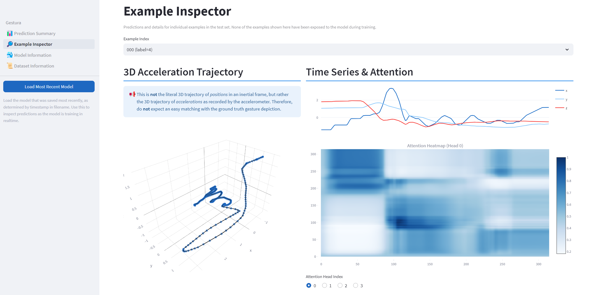

# Gestura
Gesture prediction from time-series data.

## Usage
1. Run `train.py` to train the model.
2. Run `streamlit run Gestura.py` to visualize the predictions.

(optional)
- Run `train_test_split.py` to regenerate the train/test split indices.
- Run `cleanup.py` to remove old model and optimizer checkpoints.

## Example Screenshots

</img>

